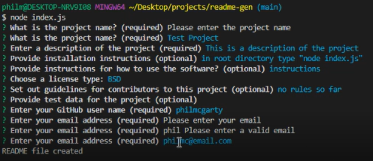
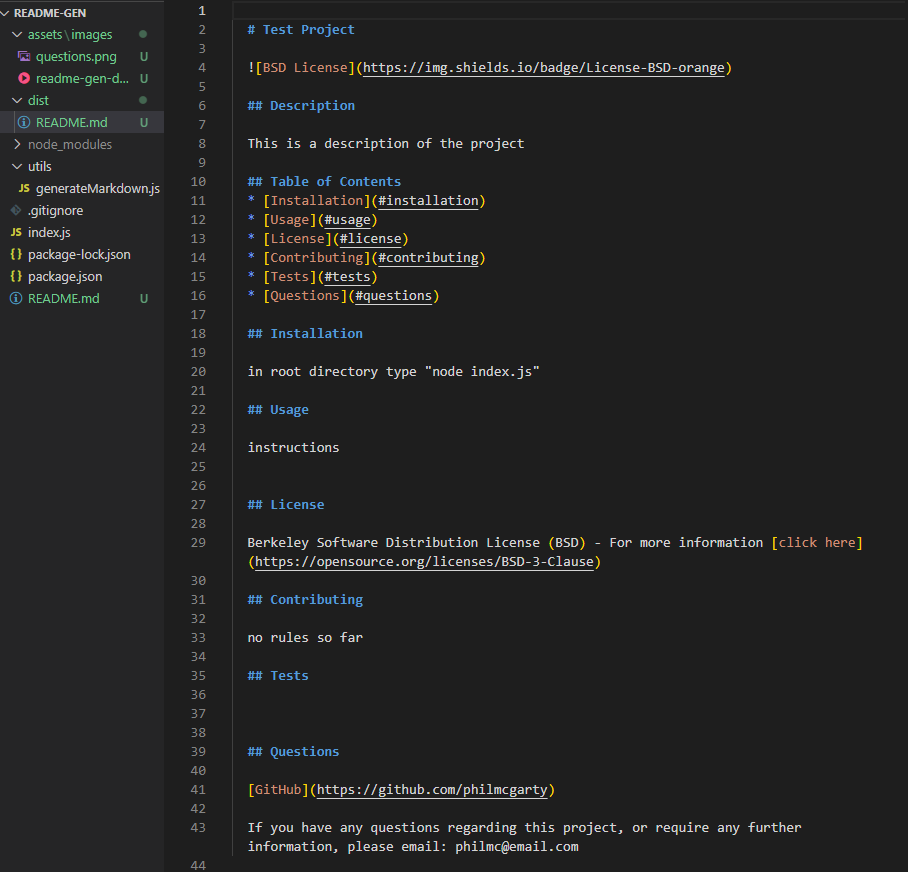
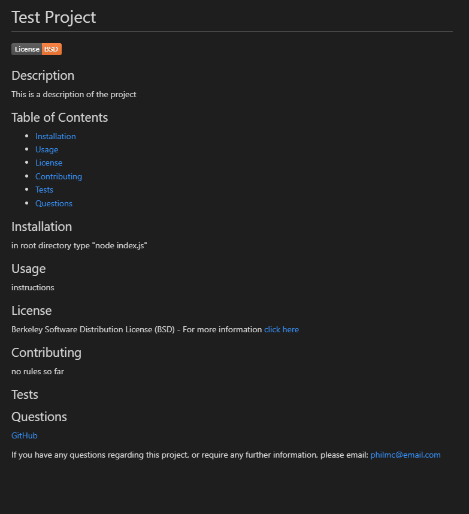

  # README Generator

  
  
  ## Description

  This software will generate a README.md file based on the answers a user provides to a series of prompts.

  ## Table of Contents
  * [Installation](#installation)
  * [Usage](#usage)
  * [License](#license)
  * [Contributing](#contributing)
  * [Tests](#tests)
  * [Questions](#questions)

  ## Installation
  
  Open a terminal window, navigate to the root directory of the application, and type: "node index.js" - this will initialize the application.

  ## Usage

  Once the application has been initialized, the user is presented with a series of prompts, for details about the README file that is to be generated - e.g. project name, description, etc.  Some of the questions are labelled as "required" and the application will not go any further until characters have been input. Other optional questions can be skipped by pressing enter, and will result in blank sections of the generated README file. The email address prompt also requires the user input to contain an "@" symbol. This is not a foolproof method, but adds some additional validation.

  Once all the prompts have been answered, the user should be presented with a "README file created" message. This means that the application has completed and the README.md file can be found within the "/dist/" folder. All of the user inputs have been entered into the correct areas of the file, and a badge and links are available for the chosen license type. The "questions" section contains links to the user's github page and their email address.
  
  The user is free to add or edit the file markdown should they wish to.

  ## License
  
  Berkeley Software Distribution License (BSD) - For more information [click here](https://opensource.org/licenses/BSD-3-Clause)

  ## Contributing

  This is a personal project and does not require any community contributions.

  ## Tests

  The following images are of the application running through a test case

  The initial file run command, the user prompt questions,and the confirmation message
  

  The generated markdown README file, found in the "dist" folder
  

  A preview of the README file displaying all the user inputs, the license badge, and links
  

  [Video Demo on Googledrive](https://drive.google.com/file/d/1ICnkV43rl5TmGU6MX2WYTqCiGiy_bSq8/view?usp=sharing)

  ## Questions

  [GitHub](https://github.com/philmcgarty)

  [GitHub Application Page](https://github.com/philmcgarty/readme-gen)

  If you have any questions regarding this project, or require any further information, please reach out through GitHub

